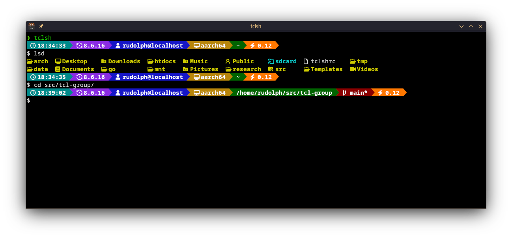

# Powerline Prompt for Tcl (tclsh)

This is a modern, modular, powerline-style prompt for the standard Tcl shell (`tclsh`). It's written in pure Tcl, provides support for `tclreadline`, and is designed to be configurable and extensible.

It provides a feature-rich, visually appealing prompt without requiring any external dependencies other than `tclreadline` and a patched font.



## Features

* **Powerline-Style Segments:** Seamless, connecting segments for a modern look.
* **Git Integration:** Automatically shows your current branch and a `*` for dirty status (modified, untracked, or staged files).
* **Dynamic Segments:** Only shows relevant info (like Git status) when you're in a relevant directory.
* **Rich Info Display:**
    * Current Time
    * Tcl Version
    * User & Hostname
    * Machine Architecture (e.g., `x86_64`)
    * Current Working Directory (with `~` substitution for home)
    * 1-Minute System Load Average
* **Configurable Theme:** All segment colors are defined in a central `prompt_theme` array, making customization simple.
* **Robust Readline Integration:** Correctly renders as a non-editable prompt string in `tclreadline`.

## Requirements

1.  **Tcl and Tk:** This prompt requires both Tcl and the Tk toolkit to be installed.

2.  **`tclreadline` Package:** This is a critical dependency for interactive editing. You can typically install it and its dependencies using your system's package manager.

    * **Ubuntu / Debian:**
        ```sh
        sudo apt update && sudo apt install tcl-tclreadline tk
        ```
    * **Arch Linux:**
        ```sh
        sudo pacman -S tclreadline tk
        ```
    * **Fedora:**
        ```sh
        sudo dnf install tclreadline tk
        ```

3.  **Nerd Font / Powerline Font:** You **must** use a "Nerd Font" or another font patched with Powerline symbols. This script uses icons and special characters (like `` and ``) that will not render correctly without a patched font.

**Note for Modern Arch-Based Systems** 📝

The version of `tclreadline` in the standard repositories (v2.3.8) may fail to compile because its code conflicts with modern C language standards. The fastest solution is to build the newer `v2.4.1`, which fixes this, directly from the source:

```sh
# Install build dependencies
sudo pacman -S --needed base-devel tcl tk readline

# Clone, build, and install tclreadline v2.4.1
git clone https://github.com/flightaware/tclreadline.git
cd tclreadline
git checkout v2.4.1
./autogen.sh
./configure --prefix=/usr
make
sudo make installi
```
## Installation

1.  Clone this repository to a permanent location on your machine (e.g., `~/src/tcl-prompt`).

2.  Add the following line to your `~/.tclshrc` file (create the file if it doesn't exist):

```tcl
# Source the powerline prompt from its repository location
# Update this path to wherever you cloned the repo
source ~/src/tcl-prompt/tclshrc.tcl
```

3.  Start `tclsh` and enjoy your new prompt.

**Note:** If the `tclreadline` package is not installed or cannot be found, this script will gracefully fall back to a simple, uncolored prompt (e.g., `user@host:path > `) instead of the powerline interface.

## Customization

To change colors, simply edit the `array set prompt_theme` definition near the top of the `tclshrc.tcl` script. All segments reference this array, allowing for easy and safe theme changes.

